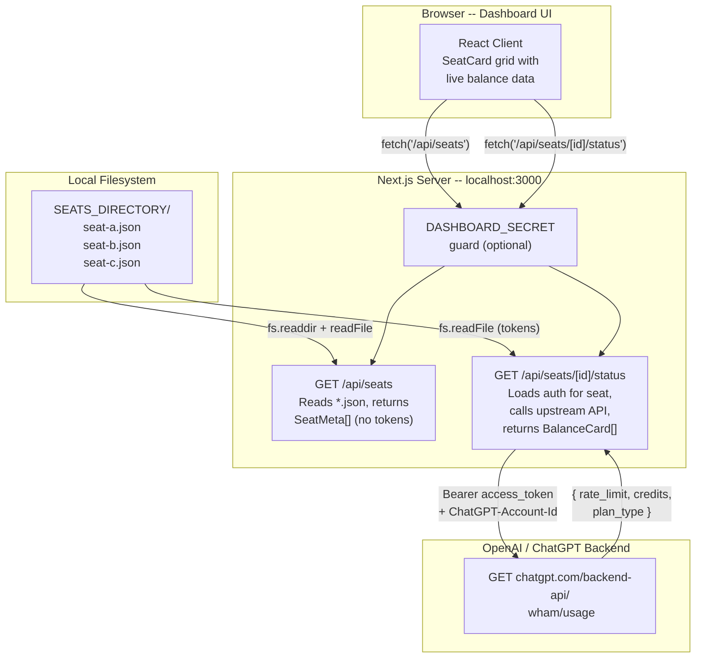
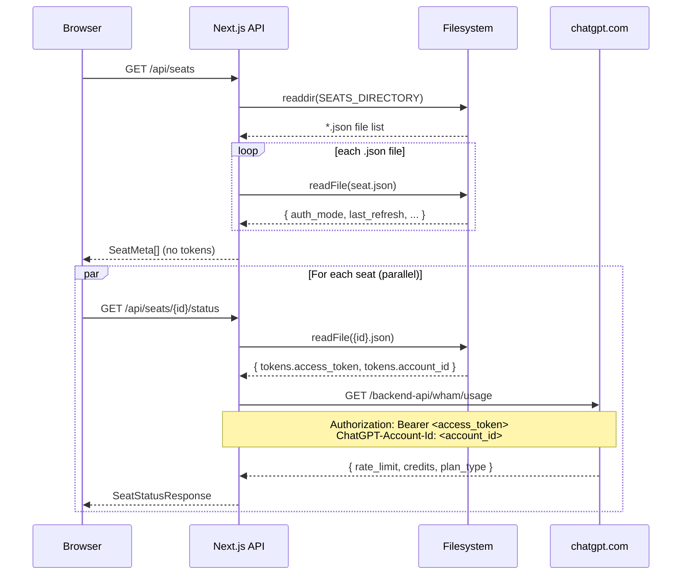
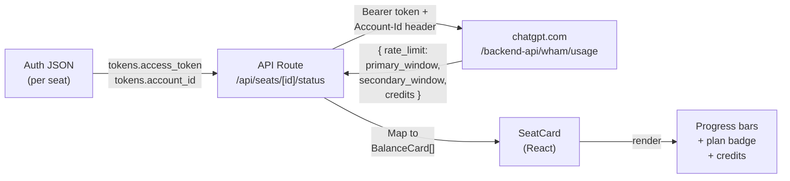

# Codex Seat Meter

A local monitoring dashboard for tracking usage limits across multiple OpenAI Codex seats. Drop in your auth files, start the server, and see every seat's balance at a glance.

## The Problem

Managing multiple Codex seats means checking each settings dashboard individually. There is no aggregated view. This project solves that by reading auth tokens from a local folder and querying the same usage API that the Codex app uses internally.

## How It Works



### Request Lifecycle



## Quick Start

```bash
# 1. Clone and install
git clone https://github.com/<you>/codex-seat-meter.git
cd codex-seat-meter
npm install

# 2. Configure
cp .env.example .env
# Edit .env: set SEATS_DIRECTORY to a folder with your auth JSONs

# 3. Run
npm run dev
# Open http://localhost:3000
```

## Auth File Format

Each seat is a `.json` file in your `SEATS_DIRECTORY`. The filename (without extension) becomes the seat ID shown in the dashboard.

```json
{
  "auth_mode": "chatgpt",
  "OPENAI_API_KEY": null,
  "tokens": {
    "id_token": "eyJ...",
    "access_token": "eyJ...",
    "refresh_token": "...",
    "account_id": "account-..."
  },
  "last_refresh": "2026-02-16T20:46:20.652669Z"
}
```

These files are the same format used by the Codex CLI (`~/.codex/auth.json`). To monitor multiple seats, copy each seat's auth file into your seats directory with a descriptive name (e.g. `team-alpha.json`, `personal.json`).

## Configuration

| Variable | Required | Default | Description |
|----------|----------|---------|-------------|
| `SEATS_DIRECTORY` | Yes | -- | Absolute path to the folder containing auth JSON files |
| `CODEX_USAGE_BASE_URL` | No | `https://chatgpt.com/backend-api` | Base URL for the usage API |
| `CODEX_USAGE_PATH` | No | `wham/usage` | Path appended to the base URL |
| `DASHBOARD_SECRET` | No | -- | Shared secret to protect API routes (see [Security](#security)) |

## API Reference

### `GET /api/seats`

Returns metadata for all seats. No tokens are included in the response.

**Response `200`**
```json
[
  { "id": "team-alpha", "auth_mode": "chatgpt", "last_refresh": "2026-02-16T20:46:20Z" },
  { "id": "personal",   "auth_mode": "chatgpt", "last_refresh": "2026-02-15T10:00:00Z" }
]
```

Seats with unparsable auth files include an `error` field instead of metadata.

### `GET /api/seats/[id]/status`

Fetches live balance from the upstream usage API for a single seat.

**Response `200`**
```json
{
  "ok": true,
  "balance": {
    "fiveHourUsageLimit": { "label": "5 hour usage limit", "remainingPercent": 85, "resetAt": "2026-02-17T15:00:00.000Z" },
    "weeklyUsageLimit":   { "label": "Weekly usage limit",  "remainingPercent": 3,  "resetAt": "2026-02-21T11:03:00.000Z" },
    "codeReview": null
  },
  "planType": "pro",
  "credits": { "hasCredits": true, "unlimited": false, "balance": 150.0 }
}
```

| Status | Meaning |
|--------|---------|
| `401` | Token expired/invalid, or `DASHBOARD_SECRET` mismatch |
| `404` | Seat ID not found in configured directory |
| `502` | Upstream API error or network failure |

## Security

- **Tokens stay on the server.** Auth files are read and used exclusively in API routes. The browser never receives tokens.
- **Path traversal protection.** Seat IDs are validated to reject `/`, `\`, `..`, and null bytes. The resolved path must remain within `SEATS_DIRECTORY`.
- **Optional API auth.** Set `DASHBOARD_SECRET` in `.env`. When set, every request must include either:
  - Header: `x-dashboard-secret: <value>`
  - Query param: `?secret=<value>`
  If you protect the dashboard with a secret, the browser must send it with each request (e.g. via a reverse proxy that adds the header, or by using a client-side secret only for local dev).
- **Secrets excluded from git.** `.env`, `.env.local`, and `config/` are in `.gitignore`.

## Project Structure

```
codex-seat-meter/
  app/
    layout.tsx                    Root layout (metadata, fonts, globals)
    page.tsx                      Dashboard page (client component)
    globals.css                   Design tokens, grain overlay, grid bg
    api/
      seats/
        route.ts                  GET /api/seats
        [id]/
          status/
            route.ts              GET /api/seats/[id]/status
  components/
    SeatCard.tsx                  Per-seat card with status fetch
    BalanceCard.tsx                Individual balance gauge
  lib/
    config.ts                     Env reading (SEATS_DIRECTORY, usage URL)
    seats.ts                      Filesystem access (list, load, path guard)
    usage-mapper.ts               wham/usage JSON -> BalanceCard mapping
    usage-client.ts               Upstream usage API fetch + retry
    auth.ts                       DASHBOARD_SECRET middleware
    errors.ts                     getErrorMessage helper
    format.ts                     Date/time formatting
  types/
    seat.ts                       All shared TypeScript interfaces
```

## Data Flow Summary



| Upstream field | Dashboard mapping |
|---------------|-------------------|
| `rate_limit.primary_window` (18 000 s) | **5 hour usage limit** card |
| `rate_limit.secondary_window` (604 800 s) | **Weekly usage limit** card |
| `plan_type` | Badge on seat card (e.g. "pro") |
| `credits.balance` | Credits display on seat card |

## Known Limitations

1. **Code review card not available.** The `wham/usage` API only returns `primary_window` and `secondary_window`. Whether "Code review" is available via the same or a different endpoint is unknown.
2. **No automatic token refresh.** Expired tokens result in 401 errors. Re-run `codex` CLI to refresh tokens.
3. **Undocumented API.** The `wham/usage` endpoint is not officially documented by OpenAI and may change without notice. Based on reverse engineering from the [CodexBar](https://github.com/) project.
4. **No historical data.** The dashboard shows point-in-time snapshots only.

## Future work

Possible extensions (not yet implemented): configurable auto-refresh (polling), retry on transient API errors (502/503/429), optional token refresh via OAuth, history/trends with local persistence.

## Tech Stack

| Layer | Technology |
|-------|-----------|
| Framework | Next.js 15 (App Router) |
| Language | TypeScript (strict) |
| Styling | Tailwind CSS 3 |
| Fonts | IBM Plex (Serif / Mono / Sans) |
| Runtime | Node.js |
| Database | None |

## License

MIT
