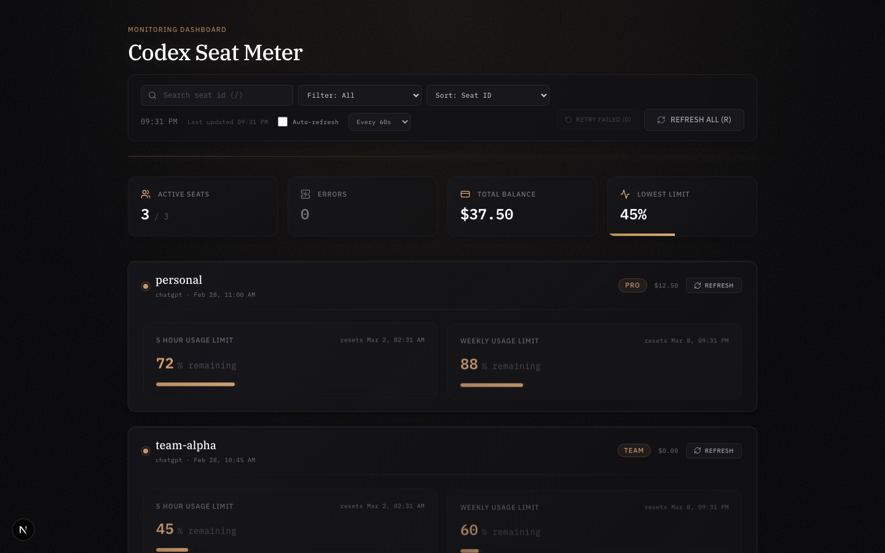
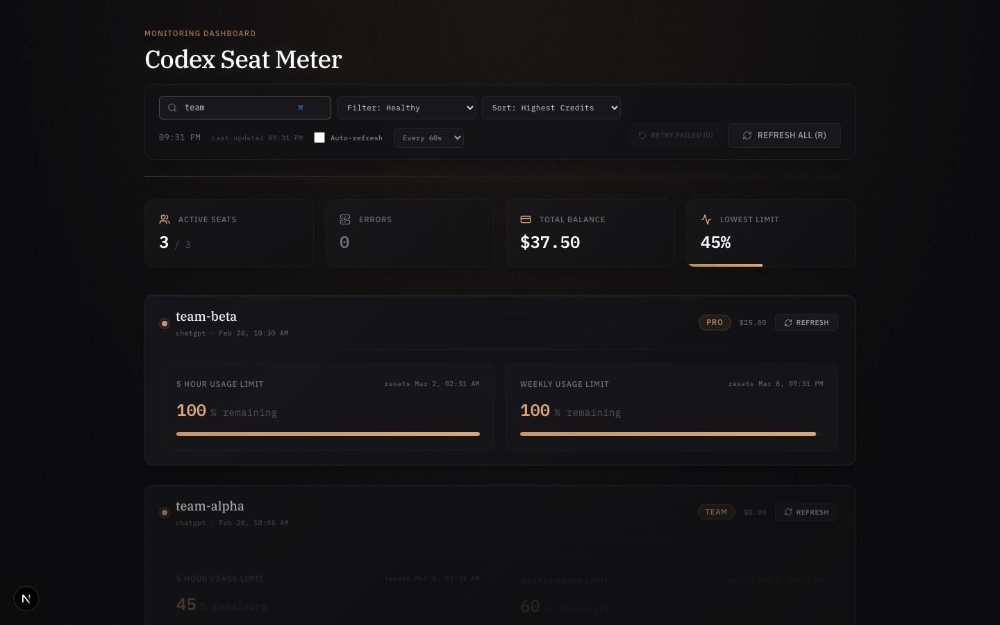
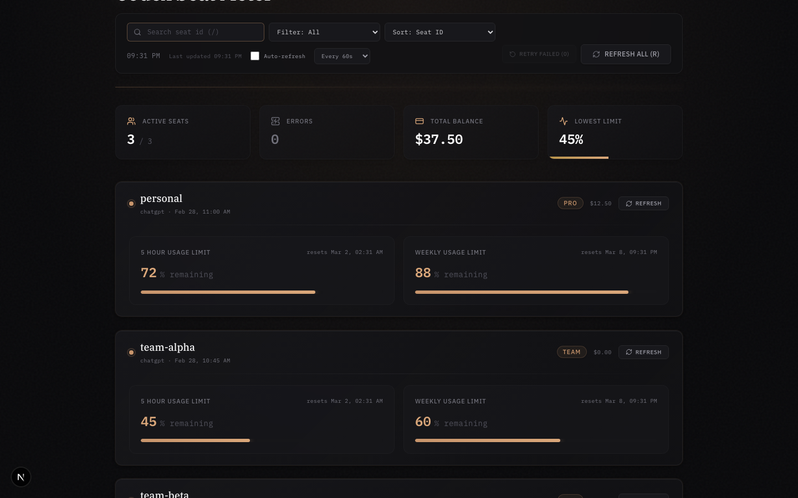
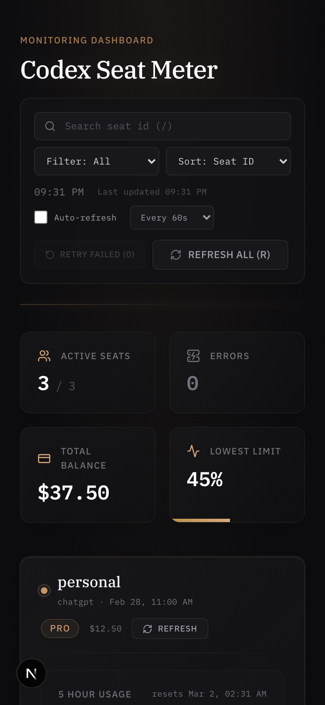

# Codex Seat Meter

Local dashboard for monitoring usage across multiple Codex seats from one screen.

## Project Status

Effective immediately, this project is deprecated. As the primary platform provider has adjusted its usage policies to accommodate dual-use and defense-related applications, I can no longer contribute to the ecosystem in good conscience. I believe AI development should remain strictly tethered to non-adversarial, civilian benefit.

## Purpose

The app reads per-seat auth JSON files from disk, fetches usage from OpenAI's backend usage endpoint, and shows limits/credits for every seat in a single dashboard.

- Runs locally on your machine.
- Tokens stay server-side.
- Supports demo mode with mock data.

## Quick Start

```bash
git clone https://github.com/your-username/codex-seat-meter.git
cd codex-seat-meter
npm install
cp .env.example .env
npm run dev
```

Open [http://localhost:3000](http://localhost:3000).

## Demo Screenshots






## Environment Variables

| Variable | Required | Default | Description |
|---|---|---|---|
| `SEATS_DIRECTORY` | Yes* | - | Absolute path to folder containing seat auth JSON files. |
| `DEMO_MODE` | No | - | `1` / `true` / `yes` enables mock seats/statuses without auth files. |
| `CODEX_USAGE_BASE_URL` | No | `https://chatgpt.com/backend-api` | Upstream usage API base URL. |
| `CODEX_USAGE_PATH` | No | `wham/usage` | Upstream usage path. |
| `DASHBOARD_SECRET` | No | - | Optional shared secret for API protection. |
| `NEXT_PUBLIC_AUTO_REFRESH_INTERVAL_MS` | No | `60000` | Default auto-refresh interval in milliseconds. |

`SEATS_DIRECTORY` is optional only when `DEMO_MODE=1`.

## Auth File Format

Each seat is one `.json` file inside `SEATS_DIRECTORY`. The filename (without `.json`) becomes the seat ID.

```json
{
  "auth_mode": "chatgpt",
  "OPENAI_API_KEY": null,
  "tokens": {
    "access_token": "...",
    "account_id": "account-..."
  },
  "last_refresh": "2026-02-16T20:46:20.652669Z"
}
```

## API Summary

All API responses are `no-store` cached.

### `GET /api/seats`
Returns seat metadata list (no tokens).

### `GET /api/seats/[id]/status`
Returns live status for one seat.

### `GET /api/seats/statuses?id=seat-a&id=seat-b`
Returns batched seat statuses. Partial failures are included per seat in `statuses`.
Legacy `ids=seat-a,seat-b` is also supported for compatibility.

## Demo Mode

Set `DEMO_MODE=1` and leave `SEATS_DIRECTORY` empty.

The dashboard serves mock seats and usage values for UI/testing without real tokens. See [demo/README.md](./demo/README.md).

## Regenerating Screenshots

```bash
npm run screenshots:readme
```

## Security Notes

- Tokens are never sent to the browser.
- Seat ID path traversal/ambiguous IDs are blocked (`/`, `\\`, `..`, control chars, and trimmed-whitespace mismatches rejected).
- Optional API auth via `DASHBOARD_SECRET`:
  - Header: `x-dashboard-secret: <secret>` (preferred)
  - Query: `?secret=<secret>` only in non-production by default, or when `ALLOW_DASHBOARD_SECRET_QUERY=1`.

## Alternatives & Successors

> This project is deprecated. Consider these actively maintained alternatives:

| Project | Description | Link |
|---------|-------------|------|
| OpenAI Usage Dashboard | Built-in usage monitoring | [platform.openai.com/usage](https://platform.openai.com/usage) |
| Helicone | Open-source LLM observability | [helicone.ai](https://helicone.ai) |
| LangSmith | LangChain observability platform | [smith.langchain.com](https://smith.langchain.com) |
| LiteLLM | Proxy with spend tracking across providers | [litellm.ai](https://litellm.ai) |

## Development

```bash
npm run dev
npm run check
npm run test
npm run coverage
```

## License

MIT
