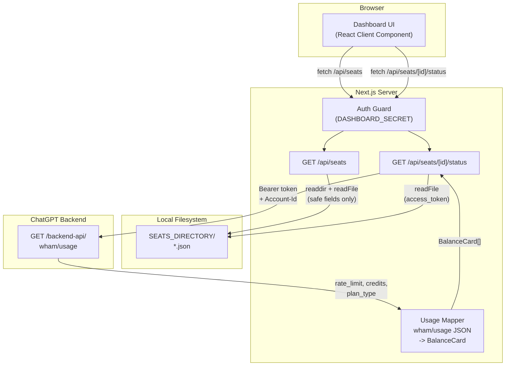

# Codex Seat Meter -- Product Requirements Document

**Version:** 0.1.0  
**Status:** MVP implemented  
**Date:** 2026-02-17

---

## 1. Summary

Codex Seat Meter is a local web dashboard for centralized monitoring of multiple OpenAI Codex seats. It reads auth files from a configurable directory, queries the balance/usage API (`wham/usage`) per seat, and displays current usage status (5-hour limit, weekly limit, credits) at a glance.

**Core problem:** Anyone managing multiple Codex seats must check each settings dashboard individually. There is no aggregated overview.

**Solution:** A single dashboard that queries all seats in parallel and visually summarizes their balance status.

---

## 2. Target Audience

| Persona | Description |
|---------|-------------|
| **Team Lead / Ops** | Manages 2-20+ Codex seats and needs to see at a glance which seats are near their limit. |
| **Individual with multiple accounts** | Uses multiple Codex accounts (e.g. personal + work) and wants centralized usage visibility. |

---

## 3. Goals and Non-Goals

### Goals

- Display all configured Codex seats on a single page.
- Fetch live balance status per seat (5h limit, weekly limit, credits).
- Immediately highlight critical states (low remaining usage visually emphasized).
- Never leak tokens to the browser; all API calls server-side.
- Simple configuration: folder with auth JSONs + `.env`.

### Non-Goals (v0.1)

- No persistent logging or historical data.
- No automatic token refresh (tokens must be refreshed externally).
- No multi-user login or role management.
- No notifications (email, Slack, etc.).
- No seat management (create, delete, rotate tokens).

---

## 4. Data Sources

### 4.1 Auth Files (Input)

One JSON file per seat in the configured `SEATS_DIRECTORY`. Filename (without `.json`) = seat ID / display name.

```json
{
  "auth_mode": "chatgpt",
  "OPENAI_API_KEY": null,
  "tokens": {
    "id_token": "eyJ...",
    "access_token": "eyJ...",
    "refresh_token": "...",
    "account_id": "account-..."
  },
  "last_refresh": "2026-02-16T20:46:20.652669Z"
}
```

### 4.2 Usage API (External)

| Field | Value |
|-------|-------|
| **Endpoint** | `GET https://chatgpt.com/backend-api/wham/usage` |
| **Auth Header** | `Authorization: Bearer <access_token>` |
| **Account Header** | `ChatGPT-Account-Id: <account_id>` |
| **Response** | JSON with `rate_limit.primary_window` (5h), `rate_limit.secondary_window` (7d), `credits`, `plan_type` |

Source: Reverse-engineered by the CodexBar project; no official OpenAI documentation exists.

---

## 5. Functional Requirements

### F1 -- Load Seat List

| ID | Requirement |
|----|-------------|
| F1.1 | The backend reads all `*.json` files from `SEATS_DIRECTORY`. |
| F1.2 | Per seat, only safe fields are returned: `id`, `auth_mode`, `last_refresh`. No tokens. |
| F1.3 | Malformed files (invalid JSON, missing fields) are listed with an error indicator, not skipped. |

### F2 -- Live Balance per Seat

| ID | Requirement |
|----|-------------|
| F2.1 | For each seat, `wham/usage` is called with that seat's `access_token` and `account_id`. |
| F2.2 | The API response is mapped to a unified balance model: label, `remainingPercent` (0-100), optional `resetAt`. |
| F2.3 | `primary_window` (18,000 s = 5 h) is displayed as "5 hour usage limit". |
| F2.4 | `secondary_window` (604,800 s = 7 d) is displayed as "Weekly usage limit". |
| F2.5 | Credits (if present) are passed through as `hasCredits`, `unlimited`, `balance`. |
| F2.6 | On error (401, 403, network, invalid JSON) a structured error message is displayed. |

### F3 -- Dashboard UI

| ID | Requirement |
|----|-------------|
| F3.1 | A single page (`/`) shows all seats as cards. |
| F3.2 | Per seat card: name/ID, `auth_mode`, `last_refresh` (formatted), balance cards. |
| F3.3 | Per balance card: label, "X% remaining", color-coded progress bar (copper > 25%, amber 10-25%, red <= 10%), optional reset date. |
| F3.4 | "Refresh all" button reloads the seat list and all balance data. |
| F3.5 | Per seat card: individual "Refresh" button. |
| F3.6 | Loading and error states for both seat list and individual balance queries. |

### F4 -- Configuration

| ID | Requirement |
|----|-------------|
| F4.1 | `SEATS_DIRECTORY` (required): absolute path to the folder with auth JSONs. |
| F4.2 | `CODEX_USAGE_BASE_URL` (optional, default: `https://chatgpt.com/backend-api`). |
| F4.3 | `CODEX_USAGE_PATH` (optional, default: `wham/usage`). |
| F4.4 | `DASHBOARD_SECRET` (optional): shared secret for API route protection. |

---

## 6. Non-Functional Requirements

### N1 -- Security

| ID | Requirement |
|----|-------------|
| N1.1 | Tokens are read and used exclusively server-side. The frontend never receives tokens. |
| N1.2 | Path traversal protection: seat IDs must not contain `/`, `\`, `..`, or null bytes; the resolved path must stay within `SEATS_DIRECTORY`. |
| N1.3 | `.env` and `config/seats.config.json` are listed in `.gitignore`. |
| N1.4 | Optional API authentication via `DASHBOARD_SECRET` (header or query parameter). |

### N2 -- Performance

| ID | Requirement |
|----|-------------|
| N2.1 | The seat list is read fresh from the filesystem on every request (no caching needed for < 100 seats). |
| N2.2 | Balance queries per seat are triggered in parallel from the frontend (one request per card). |

### N3 -- Operations

| ID | Requirement |
|----|-------------|
| N3.1 | Runs locally via `npm run dev` or as a production build (`npm run build && npm start`). |
| N3.2 | No database, no external state; filesystem + API calls only. |
| N3.3 | `.env.example` documents all environment variables. |

---

## 7. Architecture



### Tech Stack

| Layer | Technology |
|-------|-----------|
| Runtime | Node.js |
| Framework | Next.js 15 (App Router) |
| Language | TypeScript (strict) |
| Styling | Tailwind CSS 3 |
| Fonts | IBM Plex (Serif, Mono, Sans) |
| State | React 19 (useState/useEffect, no external state library) |
| Database | None |
| Auth (internal) | Optional shared secret |

### File Structure

```
codex-seat-meter/
  app/
    layout.tsx                Root layout (metadata, fonts, globals)
    page.tsx                  Dashboard (client component)
    globals.css               Design tokens, grain overlay, grid background
    api/
      seats/
        route.ts              GET /api/seats
        [id]/
          status/
            route.ts          GET /api/seats/[id]/status
  components/
    SeatCard.tsx              Per-seat card with status fetch logic
    BalanceCard.tsx            Individual balance display (gauge + bar)
  lib/
    config.ts                 Env reading (SEATS_DIRECTORY, usage URL)
    seats.ts                  Filesystem access (listSeats, loadSeatAuth, path guard)
    usage-mapper.ts           wham/usage JSON -> BalanceCard mapping
    auth.ts                   DASHBOARD_SECRET guard
  types/
    seat.ts                   All shared TypeScript interfaces
  docs/
    PRD.md                    This document
  .env.example                Documented env template
  README.md                   Project documentation with diagrams
```

---

## 8. Data Model

### 8.1 Auth JSON (Input, per file)

```typescript
interface AuthJson {
  auth_mode?: string;
  OPENAI_API_KEY?: string | null;
  tokens?: {
    id_token?: string;
    access_token: string;
    refresh_token?: string;
    account_id?: string;
  };
  last_refresh?: string;
}
```

### 8.2 SeatMeta (API output, no token leakage)

```typescript
interface SeatMeta {
  id: string;           // filename without .json
  auth_mode?: string;
  last_refresh?: string;
  error?: string;       // set when auth file is malformed
}
```

### 8.3 BalanceCard (UI model)

```typescript
interface BalanceCard {
  label: string;            // "5 hour usage limit", "Weekly usage limit"
  remainingPercent: number; // 0-100
  resetAt?: string;         // ISO-8601
}
```

### 8.4 SeatStatusResponse / SeatStatusError

```typescript
interface SeatStatusResponse {
  ok: true;
  balance: {
    fiveHourUsageLimit: BalanceCard;
    weeklyUsageLimit: BalanceCard;
    codeReview?: BalanceCard | null;
  };
  planType?: string;
  credits?: { hasCredits: boolean; unlimited: boolean; balance?: number };
}

interface SeatStatusError {
  ok: false;
  error: string;
}
```

---

## 9. API Specification

### GET /api/seats

**Description:** List all seats (metadata only, no tokens).

**Auth:** `DASHBOARD_SECRET` (if configured).

**Response 200:**
```json
[
  { "id": "team-alpha", "auth_mode": "chatgpt", "last_refresh": "2026-02-16T20:46:20Z" },
  { "id": "personal",   "auth_mode": "chatgpt", "last_refresh": "2026-02-15T10:00:00Z" }
]
```

**Response 401:** `{ "error": "Unauthorized" }` (secret missing or wrong)  
**Response 500:** `{ "error": "SEATS_DIRECTORY is not set" }`

---

### GET /api/seats/[id]/status

**Description:** Live balance data for a single seat.

**Auth:** `DASHBOARD_SECRET` (if configured).

**Response 200:**
```json
{
  "ok": true,
  "balance": {
    "fiveHourUsageLimit": {
      "label": "5 hour usage limit",
      "remainingPercent": 85,
      "resetAt": "2026-02-17T15:00:00.000Z"
    },
    "weeklyUsageLimit": {
      "label": "Weekly usage limit",
      "remainingPercent": 3,
      "resetAt": "2026-02-21T11:03:00.000Z"
    },
    "codeReview": null
  },
  "planType": "pro",
  "credits": { "hasCredits": true, "unlimited": false, "balance": 150.0 }
}
```

| Status | Meaning |
|--------|---------|
| `401` | Token expired/invalid, or DASHBOARD_SECRET mismatch |
| `404` | Seat ID not found |
| `502` | Upstream API error or network failure |

---

## 10. Known Limitations

| # | Limitation | Impact |
|---|-----------|--------|
| 1 | **Code review card not available.** The `wham/usage` API returns only `primary_window` (5h) and `secondary_window` (7d). Whether "Code review" is available via the same or a different endpoint is unknown. | Third card not displayed. |
| 2 | **No token refresh.** Expired tokens result in 401 errors. | Users must manually refresh tokens (e.g. run `codex` CLI). |
| 3 | **Undocumented API.** `wham/usage` is not officially documented by OpenAI. | Endpoint may change without notice. |
| 4 | **No history/trends.** Point-in-time snapshots only. | No trend analysis possible. |

---

## 11. Roadmap

### Phase 1 -- MVP (current)

- [x] Seat list from auth JSONs
- [x] Live balance per seat (5h + weekly)
- [x] Color-coded progress bars
- [x] Refresh all + per-seat refresh
- [x] Path traversal protection
- [x] Optional API authentication
- [x] Plan type + credits display
- [x] Error indicator for malformed auth files

### Phase 2 -- Stabilization

- [ ] **Token refresh:** Automatically refresh expired tokens (POST auth.openai.com/oauth/token, write back to auth file).
- [ ] **Code review card:** Identify API endpoint or implement web scraping fallback.
- [ ] **Auto-refresh:** Configurable polling intervals (e.g. every 60 s).
- [ ] **Error recovery:** Retry logic for transient errors (429, 503).

### Phase 3 -- Extended

- [ ] **History and trends:** Periodic snapshots in SQLite/JSON; line charts per seat.
- [ ] **Notifications:** Slack/Discord webhook or email when remaining < threshold.
- [ ] **Multi-provider:** Support Cursor seats alongside Codex (different API, see CodexBar).
- [ ] **Deployment:** Docker image, optional Vercel deploy with encrypted secret store.

---

## 12. Glossary

| Term | Meaning |
|------|---------|
| **Seat** | A single Codex account, identified by an auth JSON file. |
| **Auth JSON** | File containing tokens and metadata (`access_token`, `account_id`, etc.) for a Codex account. |
| **wham/usage** | Internal ChatGPT backend endpoint for usage data (not officially documented). |
| **primary_window** | 5-hour usage window (18,000 s). |
| **secondary_window** | Weekly usage window (604,800 s). |
| **Balance** | Percentage of remaining usage within a time window. |
| **DASHBOARD_SECRET** | Optional shared secret for API route protection. |
